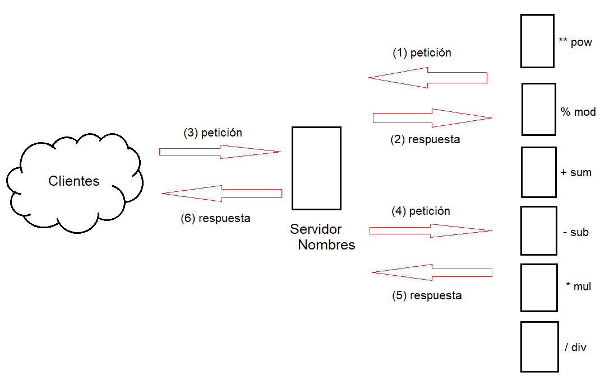
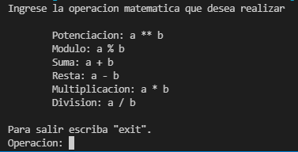

# Calculadora Sockets

Calculadora creada en Java que implementa sockets, actualmente UDP, para
comunicarse con los servidores, escritos en Python que finalmente se encargan de
resolver las operaciones solicitadas.

## ¿Por qué hacer esto?

El objetivo de hacer esta calculadora no está en la funcionalidad en si misma
sino en dar un ejemplo introductorio a la programación y uso de sockets.

## Estructura del proyecto

El proyecto está estructurado en dos carpetas cliente y servidor.

- **cliente:** Contiene la carpeta src donde está el código sin compilar de la
<<<<<<< HEAD
  calculadora para saber más sobre el cliente y como compilarlo vaya a su
  [documentación](cliente/README.md).
=======
  calculadora para saber más sobre comó funciona el cliente y como compilarlo
  vaya a su documentación.
>>>>>>> 570f2e15f2d26199baf3c62e7f8209ae98c5c439
- **servidor:** Contiene los servidores cuyos scripts siguen el siguiente
  formato de nombramiento: `servidor\<nombre>.py`, en la sección de servidores
  tiene la lista de los nombres de los servidores, y la clase `ConnectionHelper`
  en `connection.py` la cual abstrae la logica de los sockets del funcionamiento
  real del servidor.

## Arquitectura

El proyecto se basa en la arquitectura siguiente



Los servidores que ofrecen los distintos servicios (1) enviaran una solicitud de
registro al servidor de nombres. (2) El servidor de nombres enviara un mensaje
de confirmación de su registro. (3) La calculadora envía una operación con sus
datos, el servidor de nombres interpretará la operación y (4) enviará los datos
al servidor correspondiente, quien (5) responderá con el resultado de la
operación o un mensaje de error, ejemplo de esto es si se intenta hacer una
división por cero, (6) la respuesta será inmediatamente enviada por el servidor
de nombres al cliente sin procesar nada. Si la operación solicitada no tiene un
servidor registrado capaz de atenderla el servidor de nombres devuelve un
mensaje de error inmediatamente.

## Servidores

Por defecto los servidores funcionan en localhost y utiliza los puertos
20000 – 20006 como se muestra en la tabla siguiente:

| Nombre  | Puerto | Host      | Operación |
| ------- | ------ | --------- | --------- |
| nombres | 20000  | localhost | -         |
| pow     | 20001  | localhost | a \*\* b  |
| mod     | 20002  | localhost | a % b     |
| sum     | 20003  | localhost | a + b     |
| sub     | 20004  | localhost | a - b     |
| mul     | 20005  | localhost | a \* b    |
| div     | 20006  | localhost | a / b     |

## Guía de uso

Ahora explicaremos como poner los servidores en ejecución y como utilizar la
aplicación cliente tanto en modo consola como grafica.

### Poner todo en funcionamiento

Para ejecutar correctamente el proyecto deberemos seguir los siguientes pasos:

1. Abrir una consola o terminal y posicionarse en `<proyecto>/servidores/`
2. Usa `python servidor_nombres.py` para ejecutar el servidor de nombres.
3. Usa `python servidor_<nombre>.py` para ejecutar el servidor o servidores que quieras tener disponibles.
4. Ejecuta la aplicación cliente en modo consola o grafico para empezar a hacer solicitudes al servidor de nombres.

<<<<<<< HEAD
En la [documentación](cliente/README.md) del Cliente se explica como compilar y ejecutar el cliente.
=======
En la documentación del Cliente se explica como compilar y ejecutar el cliente.
>>>>>>> 570f2e15f2d26199baf3c62e7f8209ae98c5c439

### Cliente – Modo consola

Al ejecutar la aplicación en modo consola veremos una interfaz como la siguiente:



Se nos pedirá que ingresemos una operación valida o la palabra exit para dar por
terminado el programa.

Una operación valida es aquella que cumple el siguiente formato: `<número><operador><número>`

Donde _número_ puede ser entero o con punto decimal y _operador_ es cualquiera de los siguientes:

- ** Potencia
- % Modulo
- \+ Suma
- \- Resta
- \* Multiplicación
- / División

Los espacios son eliminados antes de evaluar la expresión por lo que cualquiera
de los siguientes se considera una expresión valida.

Ejemplos:

```
4+5
3.14/1.2
5 * 8
   7   -   9
5.   8 / 6    .   8
```
